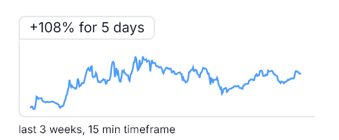

## Description

<p align="center">
  
</p>

Microservice for generating [sparklines](https://en.wikipedia.org/wiki/Sparkline) based on [OHLCV](https://docs.amberdata.io/docs/ohlcv-1) data, which is sourced from various providers using only the Ethereum token address.

Developed with Nest.js, Puppeteer.

Configured to work with the [static-assets-server](https://github.com/ziaq/static-assets-server). Key features include:

-   Generating sparklines
-   Uploading sparklines to the static-assets-server
-   Managing the deletion of outdated sparklines
-   Managing updates of database records associated with sparklines

API endpoints:
-   `/sparklines/update-multiple`
-   `/sparklines/update-single`

## Server Launch Guide

  

### Step 1: Clone the repository

  

### Step 2: Install dependencies

  

Navigate to the project directory and run the following command to install all necessary dependencies:

  

```bash

npm  install

```

  

### Step 3: Configure the environment

  

Create a '.env' file in the root directory of the project using the following template:

  

```bash

# .env file

SERVER_IP=127.0.0.1

NODE_ENV=development

SERVER_PORT=5000

TELEGRAM_BOT_TOKEN=''  # Enter your Telegram bot token here

ERROR_ALERT_CHANNEL_ID=''  # Telegram channel ID for error notifications

CORS_ORIGIN_URL=http://localhost:3000  # URL for CORS origin

REDIS_MAIN_HOST=127.0.0.1

REDIS_MAIN_PORT=6379

REDIS_MAIN_PASSWORD=''

MONGODB='' // URI

STATIC_ASSETS_SERVER_URL=http://127.0.0.1:5009

```

  

### Step 4: Run server

  

Run the following command to start the server:

  

```bash

npm  start

```

  

Upon successful startup, the console will display a message indicating that the server is running. This message will reflect the IP address and port specified in your .env file. For example:

  

```bash

Server is running on 127.0.0.1:5000

```